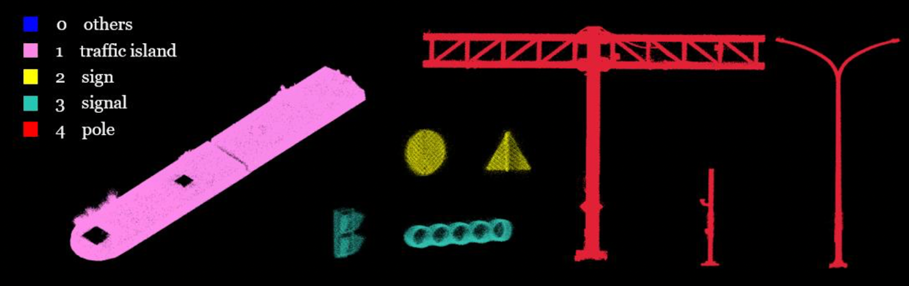
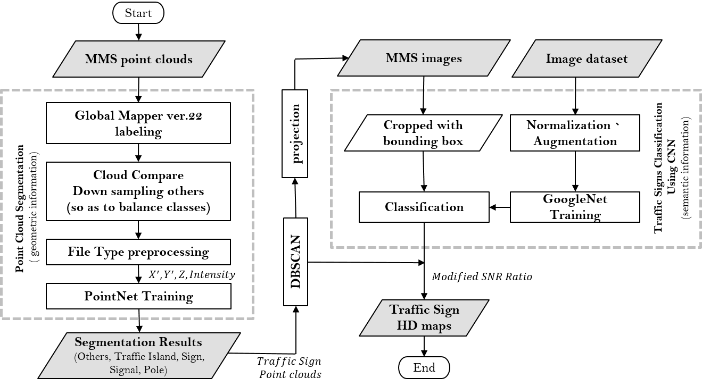

# Applying Deep Learning to MMS Point Cloud Semantic Segmentation and Image Classification for HD Map Generation

## Introduction
[ [Paper Link](https://drive.google.com/drive/u/0/folders/1b3PEfHC4_Vg8F6YlxilOYxldrap3LXq1) | [Slide](https://drive.google.com/file/d/1Wysr7aB_fIO80o47r-ZVPVcfXlpmXI1v/view?usp=sharing) ]

The ongoing race toward an autonomous era results in the development of High Definition (HD) Maps. (see [HD Map Guidelines in Taiwan](http://hdmap.geomatics.ncku.edu.tw/publications-US.php)) To help extend the vision of self-driving vehicles and guarantee safety, HD maps provide detailed information about on-road environments with precise location and semantic meaning. However, one main challenge when making such a map is that it requires a massive amount of manual annotation, which is time-consuming and laborious. 

As such, this thesis is intended to put forward the entire workflow of building static layers of traffic sign HD maps. Also, the study hopes to apply deep learning techniques in several processes in achieving automation as a faster approach to extract information. Both point cloud and image data collected by Mobile Mapping System (MMS) are used in this research. 

First, necessary components from LiDAR point clouds, including traffic islands, traffic signs, signals, and poles are extracted through [PointNet](https://github.com/charlesq34/pointnet.git).

Then, point clouds of traffic signs are clustered by the [DBSCAN](https://scikit-learn.org/stable/modules/generated/sklearn.cluster.DBSCAN.html) algorithm so that the geometric information of each traffic sign can be obtained. Also, to classify the tpye of each traffic sign cluster, point clouds of each traffic sign cluster are projected onto corresponding MMS images to crop images of interest.

Next, these images of interest are input to a [traffic sign classifier](https://github.com/liferlisiqi/Traffic-Sign-Classifier.git) based on [GoogLeNet](https://arxiv.org/abs/1409.4842). With the classification result as well as the proposed modified SNR ratio mechanism, the semantic attribute of each traffic sign cluster can be obtained.  

Finally, an output text file including precise placement of traffic sign in 3D coordinate (geolocation), the position of both bottom-left and top-right of the traffic sign bounding box (bboxMin and bboxMax), as well as the type (code) is generated for further use in HD maps.

## Requirements
Install TensorFlow. One may also need to install [h5py](https://docs.h5py.org/en/stable/). The code was tested with Python 3.7, TensorFlow 1.14.0, CUDA 11.0 on Ubuntu 16.04.

## Usage
### Stage 1. Point Cloud Segmentation
To train a model for point cloud segmentation, firstly convert Shalun experimental dataset from LAS files to txt by running `main.m` under the `preparation` folder. (See [LAS File Specification](https://www.asprs.org/a/society/committees/standards/asprs_las_format_v12.pdf))

To generate the correct data format for training input, run as the follows:
* `gen_npy_data.py`: Converts the dataset file format from txt to npy, and saved in the folder `/data/shalun_npy`.
* `gen_h5_data.py`: Converts the dataset file format from npy to h5, and saved in the folder `/data/shalun_h5`.

Run `train.py` and `test.py` in `pointnet` folder for training and testing. The trained model will be saved under the log directory with its name specified by user.

After the above training, we can evaluate the model and output the visualization of learning curve by `plot_result.py`.

### Stage 2. Point-cloud-to-image projection
Once traffic sign point clouds are separated from the set of input point clouds, run `projection.py` under `projection` folder to facilitate traffic sign classification.

The geometric information of each traffic sign point cloud cluster as well as the cropped images will be saved in a given directory.

Run `groundtruth_bbox_calculation.py` under `projection` to obtain the groundtruth geometric information of each manual annotated traffic sign for geolocation accuracy assessment.

### Stage 3. Image Classification
To classify the tpye of each traffic sign cluster, run `train.py` and `test.py` under `classification` for pre-training a traffic sign classifier and testing.

Note that this work trains its own traffic sign classifier with image dataset collected from Google Street Maps or taken in person.

